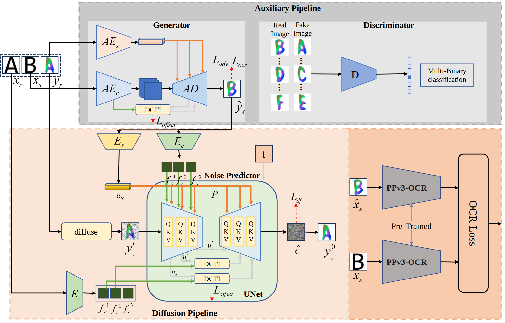
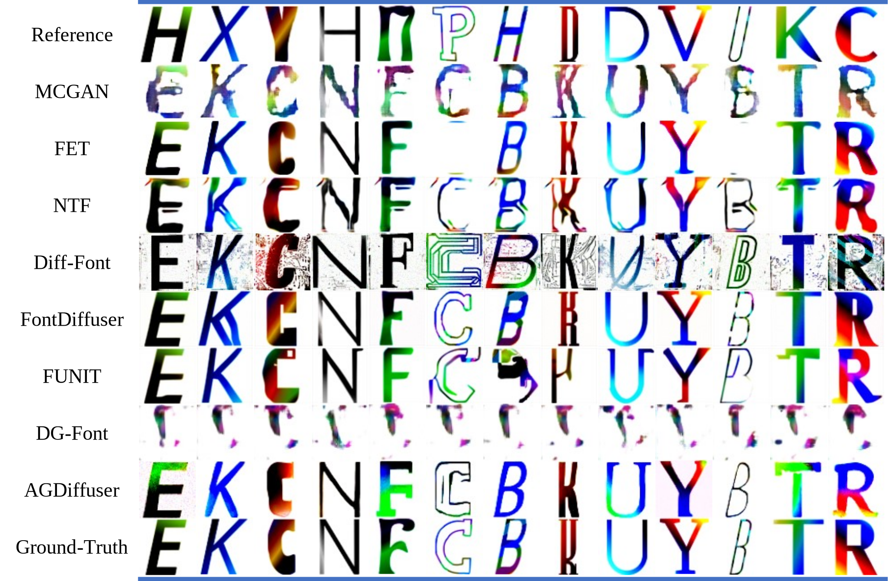
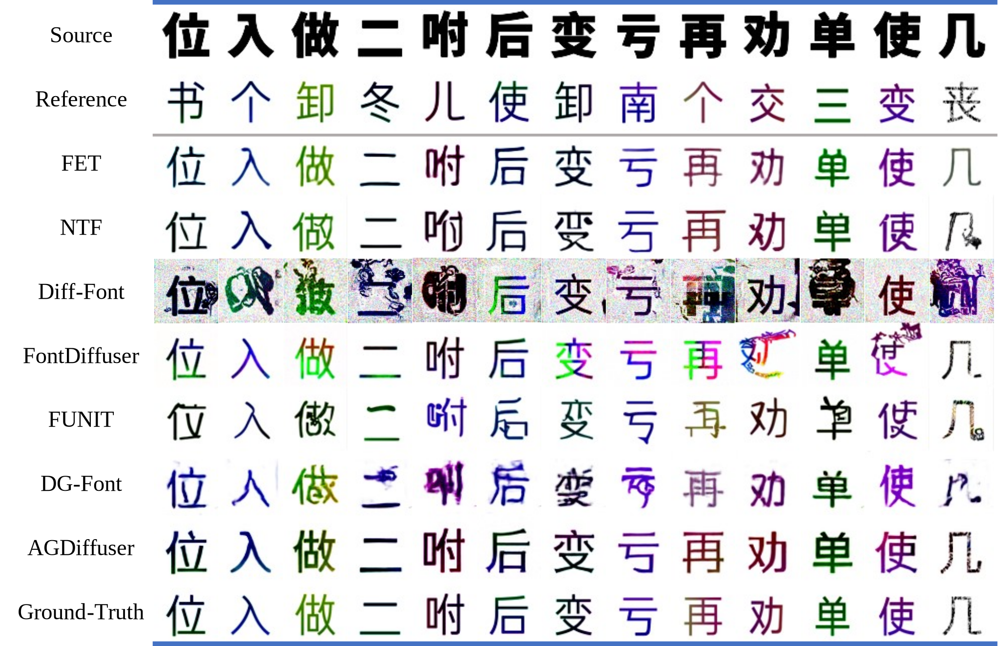
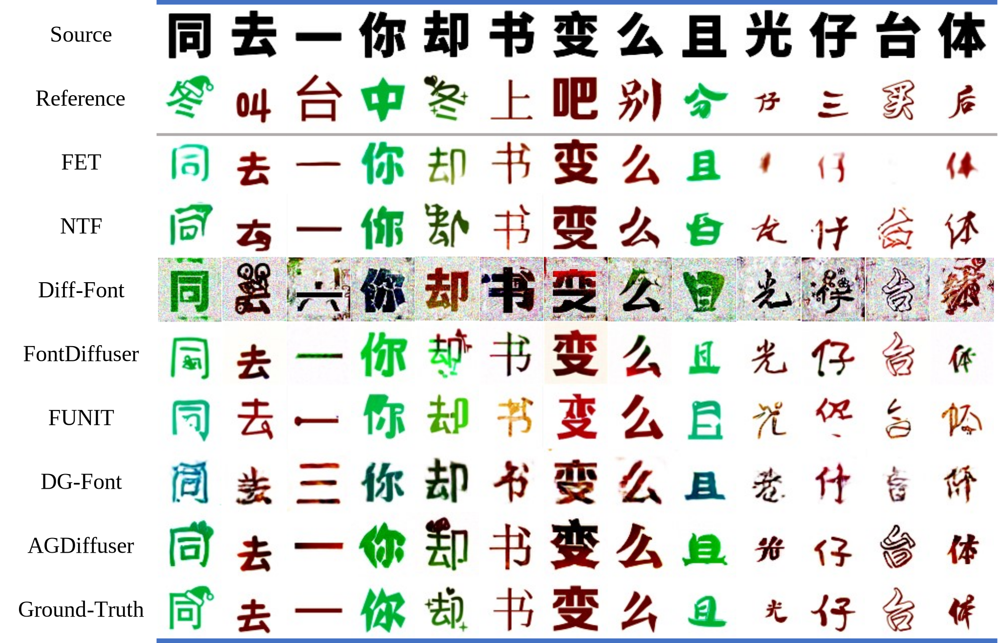
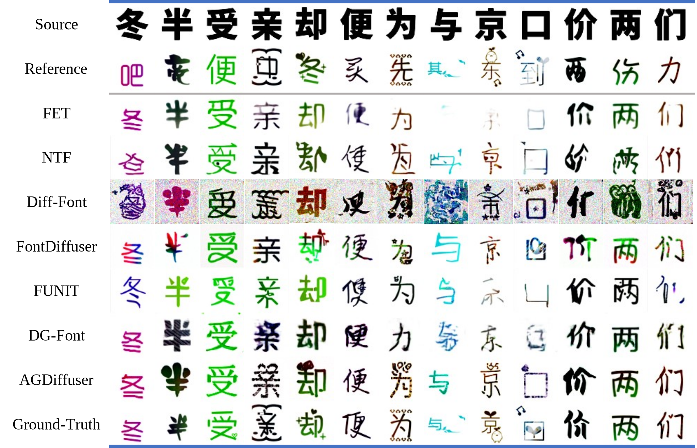

## Official code implementation based on pytorch for paper.
### The framework of our proposed method.

### Experiments
#### Visualization results comparison between state-of-the-art comparative methods and our AGDiffuser on MCGAN-Dataset.

#### Comparison of visualization results between state-of-the-art methods and our AGDiffuser in terms of style learning and generative abilities on the Chinese100-Dataset

#### Comparison of visualization results between state-of-the-art methods and our AGDiffuser in terms of shape learning and generative abilities on the Chinese100-Dataset

#### Visualization results of comprehensive shape and style tests in Chinese100-Data. The generated results of competitors often suffer from issues such as the presence of artifacts and a lack of refinement. In contrast, our method has high fidelity and is more in line with expectations.

### Run
#### MCGAN-Dataset
`python 20250302_CISGanDiff_Eng.py`
#### Chinese100-Dataset
`python 20250303_CISGanDiff_CHN.py`